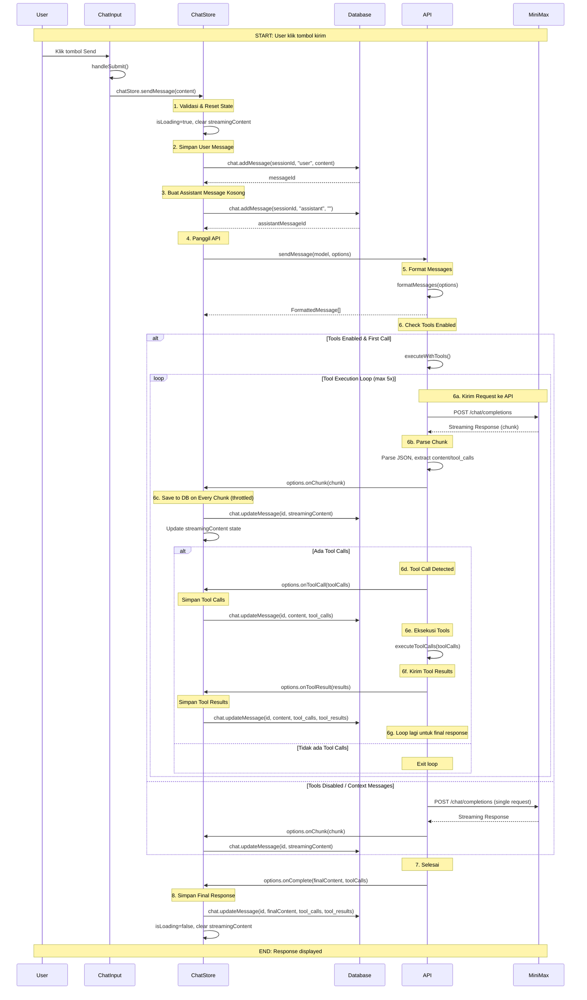

# Chat Process Flow - Alur Kirim Pesan

Document ini menjelaskan alur lengkap saat user mengirim pesan di LocalChat.

---

## Fitur yang Didukung

### 1. Chat dengan AI
- Streaming response dari OpenAI-compatible API
- Multiple system prompts (CRUD)
- Model selection
- Tool calling (calculator, now)

### 2. Markdown Rendering
- Code blocks dengan syntax highlighting
- Tables, lists, blockquotes
- Links dan formatted text

### 3. Mermaid Diagrams
- Render diagram dari code blocks
- Zoom dan pan support
- Support flowchart, sequence, class, etc.

### 4. Copy Button
- Copy kode dari code blocks
- Full text dari element code

### 5. Export/Import
- Export chat ke JSON
- Import chat dari JSON

---

## Sequence Diagram (Mermaid Format)



---

## Alur Detail per Komponen

### 1. CHAT INPUT (ChatInput.svelte)

```
User Klik Send → handleSubmit()
    ↓
chatStore.sendMessage(content)
```

**Kode:**
```typescript
async function handleSubmit() {
    if (!inputValue.trim() || chatStore.isLoading || !chatStore.currentSession) return;
    const content = inputValue;
    inputValue = '';
    await chatStore.sendMessage(content);
}
```

---

### 2. CHAT STORE (chat.svelte.ts)

```typescript
sendMessage(content):
├── Validasi: if (!currentSession || !content.trim()) return
├── Reset State: isLoading=true, streamingContent='', error=null
│
├── chat.addMessage(role='user', content) → userMessageId
│
├── chat.addMessage(role='assistant', content='') → assistantMessageId
│
├── sendMessage(model, {
│   ├── messages: this.messages (filtered)
│   ├── systemPrompt
│   ├── toolsEnabled
│   │
│   ├── onChunk: (chunk) => {
│   │       streamingContent += chunk
│   │       chat.updateMessage(id, streamingContent)  ← SAVE TO DB
│   │       Update UI state
│   │   }
│   │
│   ├── onToolCall: (toolCalls) => {
│   │       pendingToolCalls = toolCalls
│   │       chat.updateMessage(id, content, toolCallsStr)
│   │   }
│   │
│   ├── onToolResult: (results) => {
│   │       toolResults = results
│   │       chat.updateMessage(id, content, toolCalls, toolResults)
│   │   }
│   │
│   └── onComplete: (finalContent, toolCalls) => {
│       chat.updateMessage(id, finalContent, toolCalls, toolResults)
│       isLoading = false
│   }
│   })
│
└── Return
```

---

### 3. API SERVICE (api.ts)

```typescript
sendMessage(model, options):
│
├── formatMessages(options) → formattedMessages[]
│   ├── System prompt
│   ├── User/Assistant messages (from DB)
│   └── Tool results (jika ada)
│
├── Check toolsEnabled:
│
│   IF toolsEnabled && !contextMessages && !toolResults:
│   → executeWithTools()
│       │
│       ├── Loop (max 5x):
│       │   │
│       │   ├── sendRequest() → streaming response
│       │   │       └── fetch(url, stream=true)
│       │   │
│       │   ├── Parse chunk:
│       │   │       ├── content += delta.content
│       │   │       ├── reasoning += delta.reasoning
│       │   │       └── tool_calls += delta.tool_calls
│       │   │
│       │   ├── onChunk(content) ← TRIGGER CALLBACK
│       │   │
│       │   └── IF toolCalls detected:
│       │       ├── executeToolCalls() → results
│       │       ├── onToolCall(toolCalls) ← TRIGGER
│       │       ├── onToolResult(results) ← TRIGGER
│       │       └── Add to messages for next iteration
│       │
│       └── Return { content, toolCalls }
│
│   ELSE:
│   → sendRequest() (single call, no tools)
│
└── onComplete(finalContent, toolCalls) ← TRIGGER CALLBACK
```

---

### 4. DATABASE (db.ts via chat.ts)

```typescript
// Fungsi yang digunakan:

addMessage(sessionId, role, content)
    └── db.messages.add({sessionId, role, content, timestamp})

updateMessage(id, content?, toolCalls?, toolResults?)
    └── db.messages.update(id, {...updates})
```

**NOTE:** IndexedDB (Dexie.js) - Data persists across refresh

---

## Debug Points

| # | Lokasi | Cara Debug |
|---|--------|-----------|
| 1 | `ChatInput.svelte` | handleSubmit - console.log di handleSubmit |
| 2 | `chat.svelte.ts` | onChunk callback - console.log streaming content |
| 3 | `chat.svelte.ts` | onToolCall callback - console.log tool calls |
| 4 | `chat.svelte.ts` | onToolResult callback - console.log tool results |
| 5 | `chat.svelte.ts` | onComplete callback - console.log final content |
| 6 | `api.ts` | console.log request body sebelum fetch |
| 7 | `api.ts` | console.log parsed chunk |
| 8 | `markdown.ts` | Render markdown - check output HTML |
| 9 | `mermaid.ts` | Render mermaid - check SVG output |
| 10 | Database | Buka DevTools → Application → IndexedDB → LocalChatDB |

---

## Console Log yang Sudah Ada

Di kode sudah ada logging:

- `[API] Sending request: {...}` - Di api.ts saat mengirim request
- `[API] Tool iteration X` - Saat tool execution loop
- `[API] Tool calls detected` - Saat tool call terdeteksi
- `[Mermaid]` - Di mermaid.ts saat render diagram

Anda bisa menambah lebih banyak console.log sesuai kebutuhan debug!

---

## Cara Debugging

### 1. Via Browser Console

Buka DevTools → Console, lalu kirim pesan. Anda akan melihat:
- Log dari API service
- Chunk yang masuk
- Tool calls yang terdeteksi

### 2. Via IndexedDB

1. Buka DevTools → Application
2. Expand IndexedDB → LocalChatDB
3. Lihat tabel messages dan sessions
4. Refresh halaman - data harus tetap ada

### 3. Via Network Tab

1. Buka DevTools → Network
2. Filter: Fetch/XHR
3. Kirim pesan
4. Lihat request ke API MiniMax

---

## Catatan Penting

### Penyimpanannya ke Database

| Stage | Action |
|-------|--------|
| onChunk | Save ke DB setiap menerima chunk (throttled 500ms) |
| onToolCall | Save tool_calls ke DB |
| onToolResult | Save tool_results ke DB |
| onComplete | Save final content |

### Tool Calling Flow

1. User mengirim pesan
2. LLM thinking dan mungkin melakukan tool call
3. Tool dieksekusi (calculator, now)
4. Tool results dikirim kembali ke LLM
5. LLM memberikan response final

Jika error terjadi di step 2-4, lihat:
- `api.ts` - format messages dan request
- `executeWithTools()` - loop eksekusi tools
- `ToolRunner.ts` - eksekusi tool individual

### Export/Import Flow

1. **Export**: Ambil semua session dari IndexedDB → format JSON → download file
2. **Import**: Baca file JSON → parse sessions & messages → insert ke IndexedDB

Lihat: `exportImport.ts`
